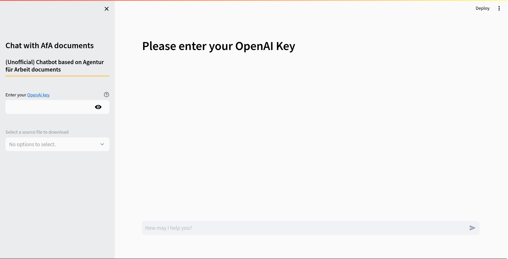

<h1 align="center">
Chat with the documents from the <i>Agentur für Arbeit</i>

</h1>

<h1 align="center">

</h1>

Thank you for your interest in my Chatbot. Please be aware that this is only a Proof of Concept system and may contain bugs or unfinished features.

This chatbot uses documents from the *Agentur für Arbeit* as a data source.
It's important to note that this is a personal project utilizing publicly available documents and is <span style="color:#ad1714;">NOT</span> an official product of the *Agentur für Arbeit*.

Please be aware that the information provided by the chatbot may not always be accurate.
It is advisable to cross-verify any critical information from reliable sources before making any decisions based on the chatbot's response.


## Streamlit

You can interact with the Streamlit app [here](https://....). You will need an **OpenAI** key.


## Installation

#### Python version: 3.10.12

1. Clone the repo:

    ```bash
    git clone https://github.com/DanieleDidino/chatbot_afa.git
    ```

2. Install dependencies:

    ```bash
    pip install -r requirements.txt
    ```
   
3. Run the app in terminal:
   
    ```bash
    streamlit run main.py
    ```


## Credits

This repo represents an updated iteration of [Bureau Bot](https://github.com/DanieleDidino/bureaubot/tree/master), initially developed by **Daniele Didino** and **Marco Zausch** as a portfolio project for the Data Science Retreat (Berlin), and mentored by **Antonio Rueda-Toicen**.
