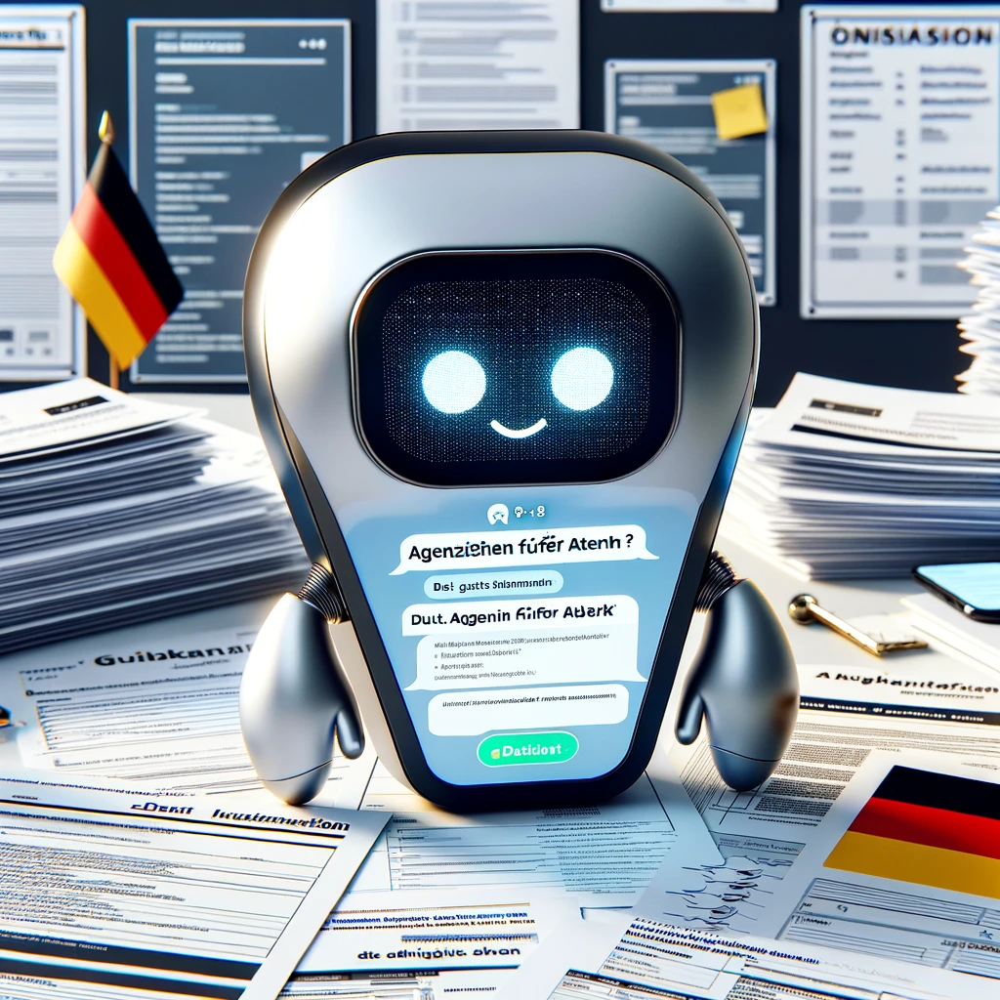
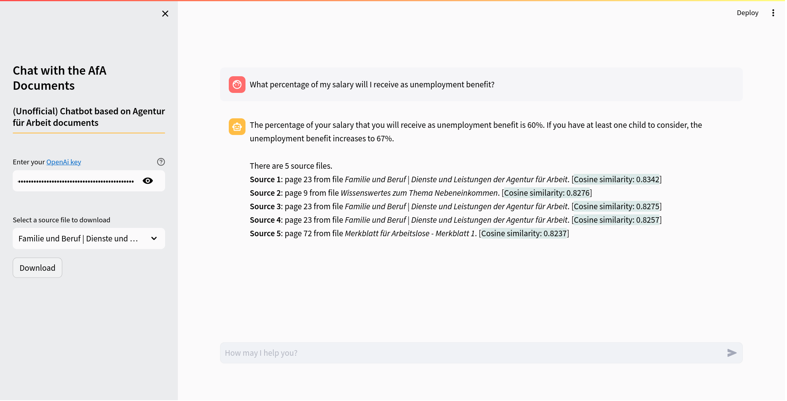
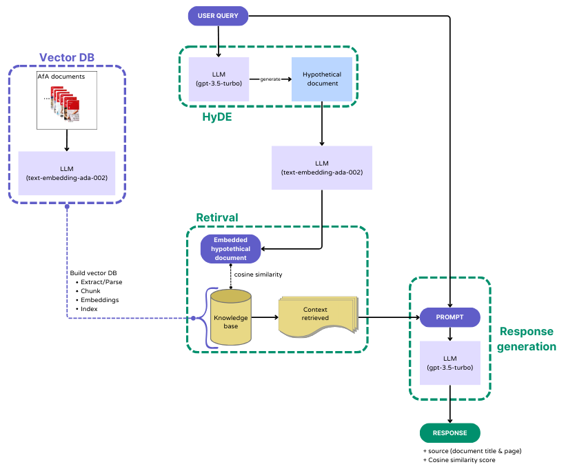

<h1 align="center">
Chat with the documents from the <i>Agentur für Arbeit</i>
<br>
<br>

</h1>


Thank you for your interest in my chatbot. Please note that this is only a Proof of Concept system and may contain bugs or unfinished features.

This chatbot uses documents from the *Agentur für Arbeit* as its data source. It responds to queries by employing these documents within a RAG pipeline framework. The chatbot provides not only the answers but also includes source details, such as the title and page, of the documents used as references. On the left column, it is also possible to download the documents used as source. Additionally, on the left column (see "*Select a source file to download*"), you have the option to download the documents that were used as sources.

Please be aware that this is a personal project that uses publicly available documents and is <span style="color:#ad1714;">NOT</span> an official product of the *Agentur für Arbeit*. Be advised that the information provided by the chatbot may not always be accurate. It's recommended to cross-check any critical information with reliable sources before making decisions based on the chatbot's responses.

<p align="center">

<br>Chatbot Screenshot
</p>

## Retrieval-Augmented Generation (RAG)

**RAG** enhances the performance of a Large Language Model (LLM). It does so by providing an additional, external knowledge base that extends beyond the LLM's original training data. This supplementary information is integrated into the LLM's process before it generates a response, enabling it to produce more informed and accurate outputs.

The RAG pipeline consists of the following steps:

1. **Vector DB**:<br>
For the construction of the knowledge base, specifically the embeddings for the Agentur für Arbeit (AfA) documents, we utilized OpenAI's “**text-embedding-ada-002**” model. The process involves breaking down the documents into smaller segments (chunks), which are then parsed into nodes. These nodes not only store the text data but also maintain metadata and relational information. The resulting data is stored in a LlamaIndex’s Vector Store. We then save these vector embeddings to disk for efficient retrieval.

2. **Hypothetical Document Embeddings (HyDE)** [[link](https://arxiv.org/abs/2212.10496)]:<br>
With HyDE, a user's query is processed by a Large Language Model (in this case, “**gpt-3.5-turbo**”) to generate a Hypothetical Document. This hypothetical document, while inaccurate, is designed to closely resemble the kind of documents that should ideally be retrieved from our knowledge base. This hypothetical document can enhance the retrieval process from the vector database, potentially outperforming direct queries from users.

3. **Retrieval**:<br>
The system retrieves the top-k (here 5) relevant items from the vector database. This is achieved by calculating the cosine similarity between the embeddings of the Hypothetical Document and those in the knowledge base. Such a method enhances the relevance and accuracy of the information retrieved.

4. **Response generation**:<br>
In the final step, the context obtained from the retrieved documents is combined with the original user query. This combined input (prompt) is then fed into an LLM (here, “**gpt-3.5-turbo**”) for response generation. This process enables the LLM to produce responses that are contextually relevant, leveraging both the query and the retrieved document information. Additionally, the chatbot provides the source details (i.e., the title and page) of the top-k retrieved items, along with their respective cosine similarity scores.

<p align="center">

<br>RAG pipeline
</p>

## Streamlit

You can interact with the Streamlit app [here](https://....). 

You will need an <b>OpenAI API key</b> (you can create one [here](https://platform.openai.com/account/api-keys)).


## Installation

#### Python version: 3.10.12

1. Clone the repo:
    ```bash
    git clone https://github.com/DanieleDidino/chatbot_afa.git
    ```

2. Create a virtual environment:
    ```bash
    python3 -m venv .venv
    ```

3. Activate the virtual environment:
    ```bash
    source .venv/bin/activate
    ```

4. Install dependencies:

    ```bash
    pip install -r requirements.txt
    ```

5. Run the app in terminal:
   
    ```bash
    streamlit run main.py
    ```

3. Deactivate the virtual environment:
    ```bash
    deactivate
    ```


## Build vector database

To build a vector database from the documents in the folder "*documents_pdf*", run in the terminal:

```bash
python3 build_vector_db.py
```

You will need to add your <b>OpenAI API key</b> in the file `.env`.
This will overwrite the previous vector database. The vector database is saved in the folder "*vector_db*".

